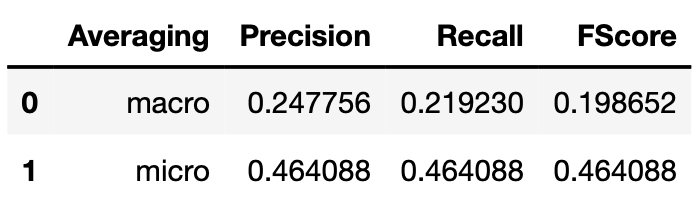
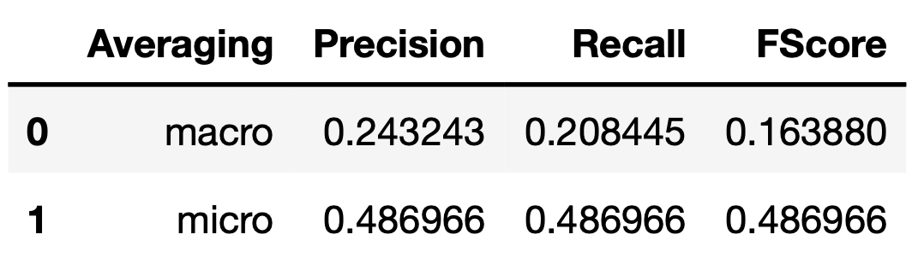
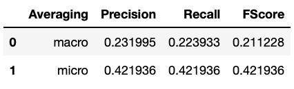
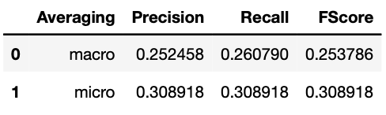

# 1. Introduction #

# 2. Tasks #
1. *r/AmItheAsshole*: YTA, NTA, ESH, NAH, SHP.
2. *r/LifeProTips*, *r/ShittyLifeProTips*, *r/UnethicalLifeProTips* and *r/IllegalLifeProTips*.

# 3. Reddit content retrieval #
For this Pushshift.io was used. It made the process of big scale data retrieval simpler and quicker than Reddit's API. We accessed Pushshift using the psaw library.
# 4. Am I The Asshole? #
<!-- Label distribution -->
**Label distribution** 
*r/amitheasshole*: 38k
- NTA: 14406
- YTA: 6361
- NAH: 3662
- SHP: 2270
- ESH: 2149
- Unlabelled: 9442
  
<!-- Train / Validation / Test split -->
**Train / Validation / Test split**
- Train: 9/16
- Validation: 3/16
- Test: 4/16

## 4.1. Validation and performance of ML models ##
<!-- Performance on test set -->
**Performance on test set Random forest n=10** 

**Performance on test set Random forest n=100** 

**Performance on test set Undersampling** 

**Performance on test set Oversampling** 

# 5. ProTips #
## 5.1. Data Retrieval and split ##
**Post retrieval**
- *r/lifeprotips* (8 years old): 30k
- *r/shittylifeprotips* (7 years old): 30k
- *r/unethicallifeprotips* (3 years old): 30k
- *r/illegallifeprotips* (2 years old): 10k

<!-- Train / Validation / Test split -->
**Train / Validation / Test split**
- Train: 4/9
- Validation: 2/9
- Test: 1/3

## 5.2. Validation and performance of ML models ##
**Validation for Naive Bayes (BOW)** 

**Validation for SVM (Word2Vec)** 

**Validation for SVM (Pre-trained Word2Vec)** 

<!-- Performance on test set -->
**Performance on test set** 

<!-- Confusion matrices -->
**Confusion matrix for Naive Bayes (BOW)** 

**Confusion matrix for SVM (Word2Vec)** 

**Confusion matrix for SVM (Pre-trained Word2Vec)** 

# 6. Conclusions and further work #
**ProTips** 
1. Best performace is achieved by SVM + Pre-trained word vectors.
2. Further exploration could show how to improve the performance of BOW + Naive Bayes, or try to come up with better language representations so that more complicated classifiers such as NNs or SVMs can achieve higher performance and make the long training time worth it.
3. More data and processing power would be needed.

**AmITheAsshole** 
1. An unbalanced dataset heavily reduces your recall and F-score, therefore under or oversampling (ideally both) should be used when facing an unbalanced dataset. However this requires some long waiting time unless you have a very strong processing power.
2. Ethical judgement based on a title or some sentence is a very complex task. Therefore it would be interesting to set a human baseline for it. This could make the expectations clearer and put the results of a model in context.
3. To improve the performance it could be explored to use the full body of the submission rather than only the title. However this should be done with well-balanced and big datasets since submissions can be very lengthy which could lead to overfitting.

