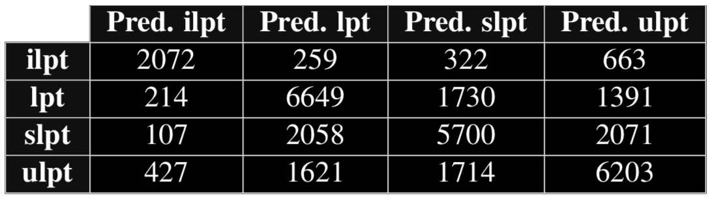

# 1. Introduction #

# 2. Tasks #
1. *r/AmItheAsshole*: YAH, NTA, ESH, NAH, SHP.
2. *r/LifeProTips*, *r/ShittyLifeProTips*, *r/UnethicalLifeProTips* and *r/IllegalLifeProTips*.

# 3. Reddit API #

# 4. Am I The Asshole? #

# 5. ProTips #
## 5.1. Data Retrieval and split ##
**Post retrieval**
- *r/lifeprotips* (8 years old): 30k
- *r/shittylifeprotips* (7 years old): 30k
- *r/unethicallifeprotips* (3 years old): 30k
- *r/illegallifeprotips* (2 years old): 10k

<!-- Train / Validation / Test split -->
**Train / Validation / Test split**
- Train: 4/9
- Validation: 2/9
- Test: 1/3

## 5.2. Validation and performance of ML models ##
**Validation for Naive Bayes (BOW)** 

**Validation for SVM (Word2Vec)** 

**Validation for SVM (Pre-trained Word2Vec)** 

<!-- Performance on test set -->
**Performance on test set** 

<!-- Confusion matrices -->
**Confusion matrix for Naive Bayes (BOW)** 

**Confusion matrix for SVM (Word2Vec)** 

**Confusion matrix for SVM (Pre-trained Word2Vec)** 

# 6. Conclusions #
**ProTips** 
In this paper an accuracy of 65.79% was achieved for tip classification using SVM and 300D pre- trained word vectors. However, a Naive Bayes model was able to achieve 62.70% with a short training time, staying really close to SVM in precision, recall and FScore. Thus, further exploration could show how to improve the performance of BOW + Naive Bayes, or try to come up with better language representations so that more compli- cated classifiers such as NNs or SVMs can achieve higher performance and make the long training time worth it.
In either case, more data and processing power would be needed.
